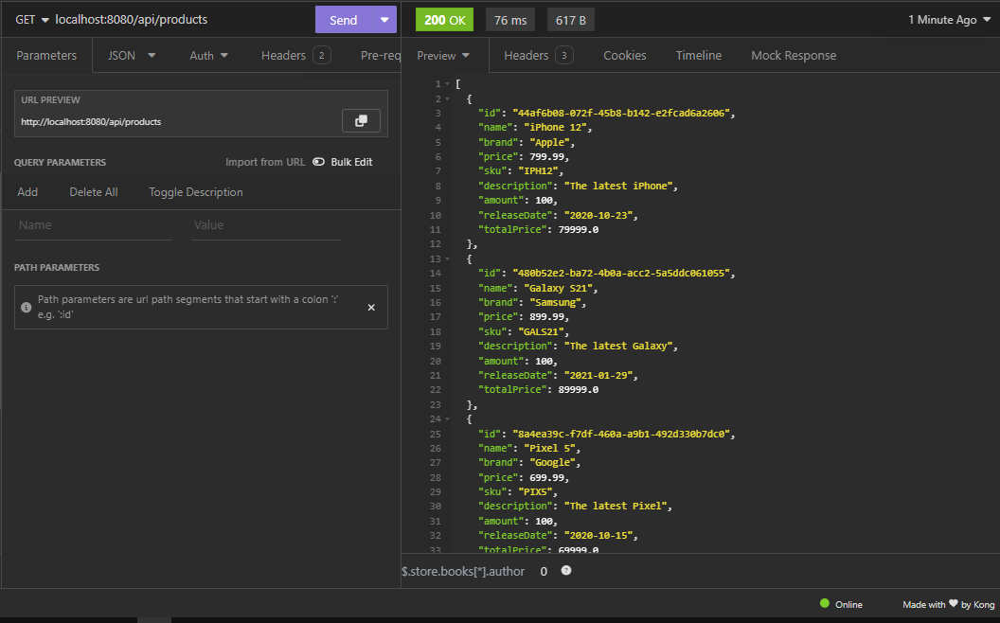
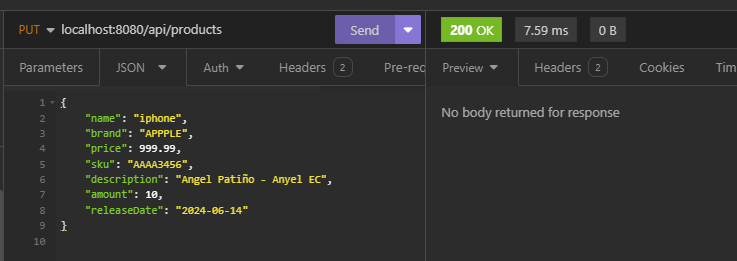

# **Select Language:** 🌍 
- [Español (Spanish)](README-es.md)
- [English](README.md)

## Microservicios de Gestión de Productos y Consumo REST

Este proyecto implementa dos microservicios dentro de un mismo proyecto en Spring Boot: uno para gestionar operaciones CRUD en productos y otro para consumir este servicio utilizando RestTemplate.

## RESULTS
## REST CONSUMER 
### Documentación de Swagger
 
### Obtener todos los productos
 
### Obtener en json

### Obtener en objeto

### Crear un producto

### Actualizar un producto

#### Estructura del Proyecto

El proyecto está estructurado en los siguientes paquetes principales:

- `top.anyel.rest.model`: Contiene la clase `Product`, que representa el modelo de datos de un producto.
- `top.anyel.rest.repository`: Aquí se encuentra `ProductRepository`, que gestiona el almacenamiento y recuperación de productos en memoria, y `RestTemplateRepository`, que realiza las operaciones de consumo del primer microservicio.
- `top.anyel.rest.service`: Contiene `ProductService`, que encapsula la lógica de negocio para operaciones CRUD de productos, y `RestTemplateService`, que proporciona métodos para consumir el servicio de productos mediante RestTemplate.
- `top.anyel.rest.controller`: Define los controladores REST para ambos microservicios: `ProductController` para operaciones CRUD de productos y `RestTemplateController` para consumir el servicio de productos mediante RestTemplate.

#### Detalles de Implementación

1. **Microservicio de Gestión de Productos (`top.anyel.rest`)**:
    - **Modelo**: `Product` define los atributos de un producto y métodos para calcular el precio total.
    - **Repositorio**: `ProductRepository` gestiona una lista de productos en memoria con operaciones CRUD básicas.
    - **Servicio**: `ProductService` proporciona métodos para interactuar con `ProductRepository` y ejecutar operaciones CRUD.
    - **Controlador**: `ProductController` expone endpoints REST para listar todos los productos, obtener un producto por ID, crear, actualizar y eliminar productos.

2. **Microservicio de Consumo (`top.anyel.rest.repository` y `top.anyel.rest.service`)**:
    - **Repositorio de RestTemplate**: `RestTemplateRepository` usa RestTemplate para consumir el servicio de gestión de productos (`http://localhost:8080/products`).
    - **Servicio de RestTemplate**: `RestTemplateService` encapsula las llamadas a `RestTemplateRepository` para obtener productos en diferentes formatos y ejecutar operaciones de creación y actualización.
    - **Controlador de RestTemplate**: `RestTemplateController` define endpoints REST para consumir el servicio de productos mediante RestTemplate, permitiendo obtener productos en JSON, objetos, y también realizar operaciones de creación y actualización.

#### Uso de Endpoints

- **Endpoints del Microservicio de Productos (`/products`)**:
    - `GET /products`: Obtiene todos los productos.
    - `GET /products/{id}`: Obtiene un producto por su ID.
    - `POST /products`: Crea un nuevo producto.
    - `PUT /products`: Actualiza un producto existente.
    - `DELETE /products/{id}`: Elimina un producto por su ID.

- **Endpoints del Microservicio de Consumo (`/api/products`)**:
    - `GET /api/products/json`: Obtiene todos los productos en formato JSON.
    - `GET /api/products`: Obtiene todos los productos.
    - `GET /api/products/objects`: Obtiene todos los productos como objetos.
    - `POST /api/products`: Crea un nuevo producto utilizando RestTemplate.
    - `POST /api/products/exchange`: Crea un nuevo producto utilizando RestTemplate con intercambio.
    - `PUT /api/products`: Actualiza un producto utilizando RestTemplate con intercambio.
    - `GET /api/products/stream`: Obtiene productos utilizando RestTemplate en formato de transmisión.

#### Configuración y Ejecución

1. **Configuración del Proyecto**:
    - Asegúrate de tener configurado Java y Maven adecuadamente en tu entorno de desarrollo.

2. **Ejecución**:
    - Clona el repositorio y abre el proyecto en tu IDE preferido.
    - Ejecuta la aplicación como una aplicación Spring Boot.
    - Los microservicios estarán disponibles en los puertos configurados (predeterminadamente `8080` para el servicio de productos y `8080` para el servicio de consumo, ajustables en `application.properties`).

#### Dependencias

El proyecto utiliza las siguientes dependencias principales:
- Spring Boot Web para la creación de APIs REST.
- Lombok para reducir el código boilerplate en las clases de modelo.
- Jackson para la serialización y deserialización de objetos JSON.
- RestTemplate para realizar llamadas RESTful a través de HTTP.

Este README proporciona una visión general del proyecto y cómo interactúan sus componentes. Para detalles adicionales sobre la implementación específica de métodos y configuraciones, consulte el código fuente en el repositorio.