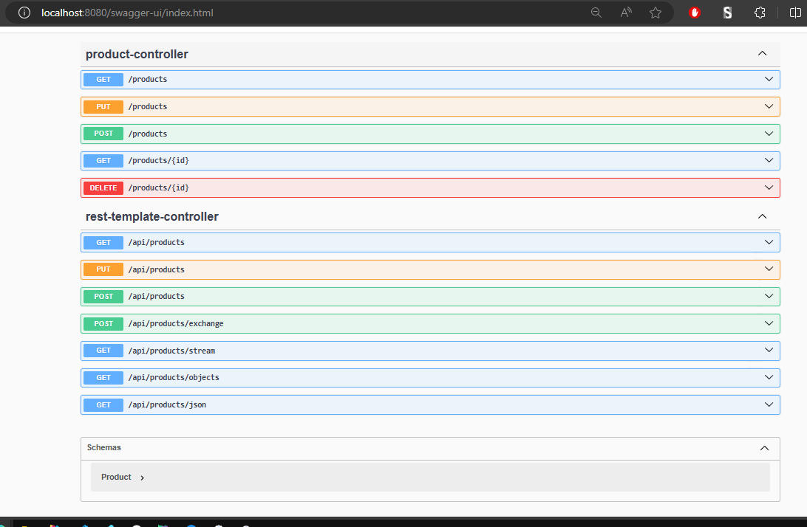
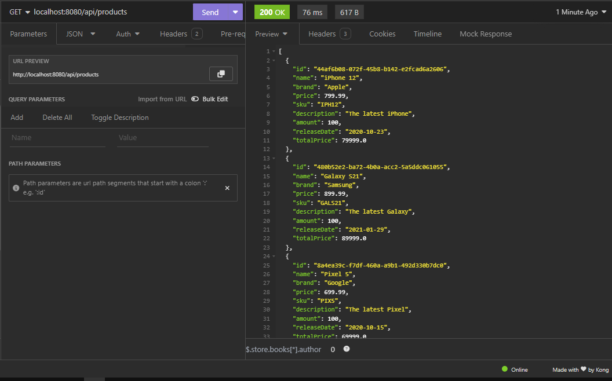
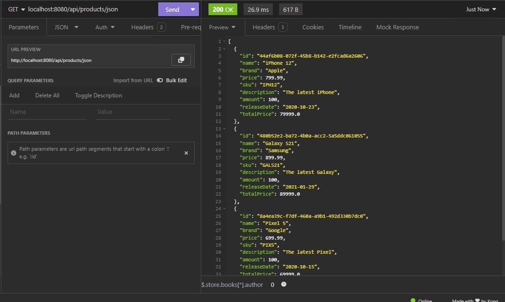
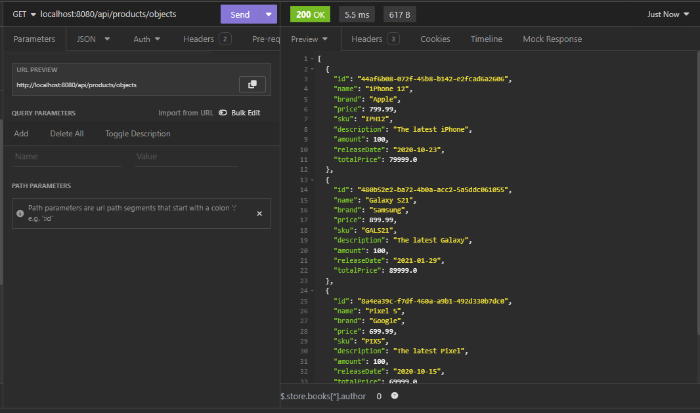
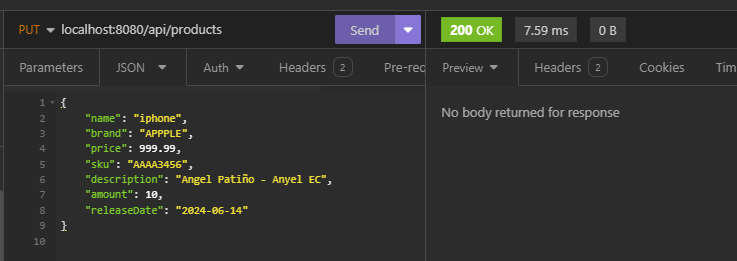

# **Select Language:** 🌍
- [Español (Spanish)](README-es.md)
- [English](README.md)

### README: Product Management and REST Consumer Microservices

This project implements two microservices within a single Spring Boot project: one for CRUD operations on products and another for consuming this service using RestTemplate.

## RESULTS
## REST CONSUMER
### Swagger Documentation

### Get all products

### Get in json

### Get in object

### Create a product

### Update a product

#### Project Structure

The project is structured into the following main packages:

- `top.anyel.rest.model`: Contains the `Product` class, which represents the data model of a product.
- `top.anyel.rest.repository`: Here lies `ProductRepository`, which manages the storage and retrieval of products in memory, and `RestTemplateRepository`, which performs operations to consume the first microservice.
- `top.anyel.rest.service`: Contains `ProductService`, encapsulating business logic for CRUD operations on products, and `RestTemplateService`, which provides methods to consume the product service using RestTemplate.
- `top.anyel.rest.controller`: Defines REST controllers for both microservices: `ProductController` for CRUD operations on products and `RestTemplateController` for consuming the product service via RestTemplate.

#### Implementation Details

1. **Product Management Microservice (`top.anyel.rest`)**:
    - **Model**: `Product` defines product attributes and methods to calculate total price.
    - **Repository**: `ProductRepository` manages a list of products in memory with basic CRUD operations.
    - **Service**: `ProductService` provides methods to interact with `ProductRepository` and execute CRUD operations.
    - **Controller**: `ProductController` exposes REST endpoints to list all products, get a product by ID, create, update, and delete products.

2. **REST Consumer Microservice (`top.anyel.rest.repository` and `top.anyel.rest.service`)**:
    - **RestTemplate Repository**: `RestTemplateRepository` uses RestTemplate to consume the product management service (`http://localhost:8080/products`).
    - **RestTemplate Service**: `RestTemplateService` encapsulates calls to `RestTemplateRepository` to fetch products in different formats and perform creation and update operations.
    - **RestTemplate Controller**: `RestTemplateController` defines REST endpoints to consume the product service via RestTemplate, allowing fetching products in JSON, objects, and performing creation and update operations.

#### Endpoint Usage

- **Product Management Microservice Endpoints (`/products`)**:
    - `GET /products`: Get all products.
    - `GET /products/{id}`: Get a product by ID.
    - `POST /products`: Create a new product.
    - `PUT /products`: Update an existing product.
    - `DELETE /products/{id}`: Delete a product by ID.

- **REST Consumer Microservice Endpoints (`/api/products`)**:
    - `GET /api/products/json`: Get all products in JSON format.
    - `GET /api/products`: Get all products.
    - `GET /api/products/objects`: Get all products as objects.
    - `POST /api/products`: Create a new product using RestTemplate.
    - `POST /api/products/exchange`: Create a new product using RestTemplate with exchange.
    - `PUT /api/products`: Update a product using RestTemplate with exchange.
    - `GET /api/products/stream`: Get products using RestTemplate in streaming format.

#### Configuration and Execution

1. **Project Setup**:
    - Ensure Java and Maven are properly configured in your development environment.

2. **Execution**:
    - Clone the repository and open the project in your preferred IDE.
    - Run the application as a Spring Boot application.
    - The microservices will be available on configured ports (typically `8080` for both product service and consumer service, adjustable in `application.properties`).

#### Dependencies

The project utilizes the following core dependencies:
- Spring Boot Web for creating REST APIs.
- Lombok to reduce boilerplate code in model classes.
- Jackson for JSON serialization and deserialization.
- RestTemplate for making RESTful calls over HTTP.

This README provides an overview of the project and how its components interact. For detailed information about specific method implementations and configurations, refer to the source code in the repository.